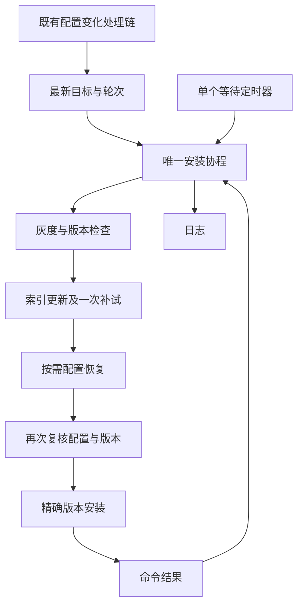
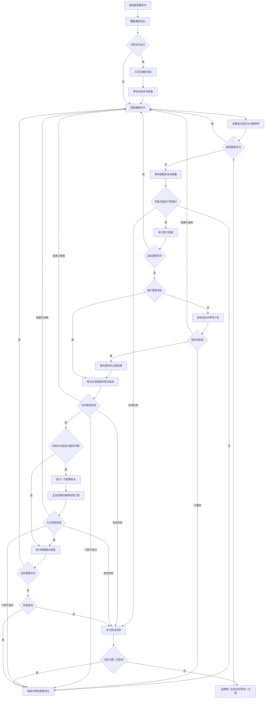
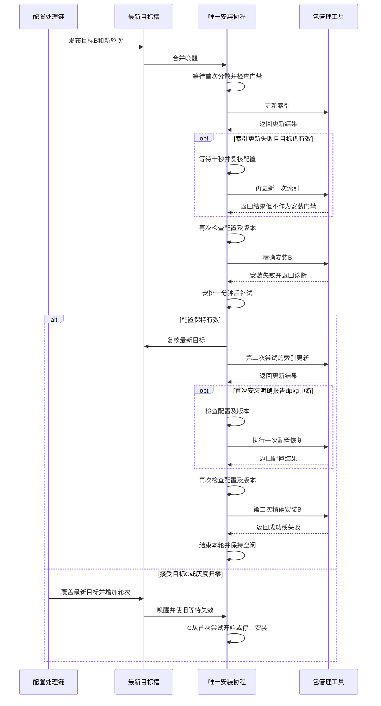

# pkg Debian 安装器方案与实现

> 状态: 已按本文完成精简实现与代码复审, 已验证Ubuntu 20.04隔离包安装. Ubuntu 26.04及生产业务包的维护脚本仍需部署环境验收.
> 本文是本主题唯一方案. 使用范围为Ubuntu 20.04及后续Ubuntu 26.04, 26.04需要实际镜像验证.

## 1. 背景与目标

pkg已经具备按配置灰度安装自包的能力. 原机制在配置变化后尝试一次, 遇到临时网络或APT锁错误便结束; 等待期间配置发生变化, 旧安装任务也可能继续执行.

本次只补齐一个职责: **根据当前配置安装指定Debian包版本, 首次安装尝试失败后延迟补试一次, 再失败就结束.** 保留生产流程中的索引更新及必要的dpkg配置恢复, 不管理业务健康、应用重启或通用包数据库修复.

最终主线:

```text
配置变化 → 灰度与版本门禁 → 串行尝试安装
                              ├─ 成功 → 结束
                              └─ 失败 → 等待一分钟 → 按最新配置补试一次 → 结束
```

等待或执行期间出现新目标时, 未开始的旧动作失效, 已启动命令执行到结束, 随后处理最新目标. **禁止降级始终有效.**

保持既有包名配置、版本字段、灰度字段、IP分桶和应用接入方式. 使用者无需提供业务回调、节点身份接口、重启许可或额外服务. 系统依赖仅为Debian包管理工具和安装权限, 不要求新增systemd服务或后台组件.

## 2. 行为契约

| 项目 | 最终决策 |
| --- | --- |
| 输入 | 初始化时确定的config.DebName, 已加载的deb_version、canary_deployment及既有RandomWait |
| 触发 | 现有配置变化处理链确认加载成功后通知安装器; 不增加启动安装和周期安装检查 |
| 唯一执行者 | 每个应用进程中最多一个安装调度协程; 所有触发共用它 |
| 等待对象 | 只保存一个最新目标, 不为每次通知创建任务协程或历史队列 |
| 尝试次数 | 每轮首次尝试加一次补试, 最多两次; 查询失败消耗本次尝试, update失败不阻断后续install |
| 补试间隔 | 固定一分钟, 不增加配置字段和多档退避; 首次RandomWait正值按秒随机分散, 非正值不等待 |
| 索引更新 | 每次安装尝试先update, 非零退出后等十秒再update一次; 两次均失败仍按最新授权尝试精确安装 |
| 配置恢复 | 仅首次install明确报告dpkg中断时, 在同轮唯一补试的install之前执行一次dpkg --configure -a |
| 安装成功 | 精确install命令正常退出且退出码为0; 不延伸到应用健康或重启成功 |
| 轮次结束 | 成功、门禁不通过或第二次失败后空闲, 等待下次真实配置变化 |
| 新配置 | 新配置替换旧目标与未执行等待; 运行中命令不因配置变化强杀 |
| 降级 | 安装前按Debian规则比较真实版本, APT命令再显式禁止降级 |
| 程序重启 | 由包脚本及既有部署机制决定, 安装器不主动请求或延迟业务重启 |
| 生命周期 | 重试仅在本进程存活时有效; 不记录磁盘任务, 不承诺跨应用或主机重启继续补试 |

“全局唯一”指**进程内唯一**, 不是多进程选主. 同机多个应用或外部运维同时操作包时, 由APT/dpkg原生锁仲裁; 锁失败按普通失败处理. 不再增加主机协调协议.

“最新配置”指已成功加载并被安装器观察到的配置, 不指尚未加载的磁盘或远端内容. 命令开始前的最后复核是本次执行的授权边界; 边界之后到达的新配置约束后续动作.

### 2.1 配置与灰度

```json
{
  "sys_conf": {
    "deb_version": "1.2.3.260916134926",
    "canary_deployment": 100
  }
}
```

沿用原分桶, 不更换哈希输入和算法, 避免重新选择既有灰度节点:

```go
// 保留内网IP与外网IP的组合, 比例不参与哈希.
bucket := xhash.HashString64(common.InternalIPv4, common.ExternalIPv4, version) % 100
eligible := threshold > 0 && threshold <= 100 && bucket < threshold
```

空版本、0%、比例大于100、非法Debian版本或灰度不命中时结束当前轮次. 1%至99%使用已经初始化的IP组合, 无有效IP时跳过; 100%不依赖IP. IP变化可能改变分桶, 本次不引入新的身份管理.

版本仅裁剪首尾空白, 用dpkg校验和比较; 保留epoch、revision、加号和波浪号. 包名必须校验, 外部命令使用参数数组, 不交给shell解释.

### 2.2 一轮与重复通知

- 现有watcher确认一次真实配置变化且加载成功, 发布最新目标. 包名在初始化时固定, 版本或灰度比例变化时开启新轮次; 安装字段相同且当前轮次尚未结束时, 保持已有次数和等待.
- 上轮已结束后, 新的真实配置变化允许再开一轮, 即使安装字段没变. RandomWait只影响新轮次的首次分散, 单独改变它不重置正在进行的轮次.
- 同一变更事件的重复唤醒不是新轮次, 不能恢复补试次数或延长等待. 轮次编号只在接受新事件时增加, 不在timer和唤醒处理时增加.
- 连续变化只保留最后一次. 同一目标的一轮最多两次尝试; 不承诺在持续发布新配置时全局总共只执行两次.
- 配置加载失败不产生可执行新轮次, 同时取消尚未执行的旧等待. 后续加载成功才能恢复; 现有watcher只在成功后推进已处理基线, 失败后恢复原内容也需再加载.

### 2.3 平台与执行能力

当前仓库只有 [sysenv.IsLinux](../../sysenv/default.go) 和Linux固定命令路径, 没有Ubuntu发行版及版本识别方法. **不新增发行版解析器或Ubuntu版本门禁**, 20.04与26.04共用安装流程和参数.

执行前要求Linux、已配置自包名、apt-get及dpkg与dpkg-query可执行、具备包管理权限且可查询自包实际版本. 缺工具或明确无权限时记录原因并结束本轮; 自包缺失时跳过, 不作为首次安装. 不自动sudo或安装工具. 工具执行中的临时查询错误仍可补试.

`/etc/os-release`不存在、读不到或未写Ubuntu均不单独阻断. 能力满足时仍可尝试; 这不代表承诺支持所有Linux发行版. 验收范围为Ubuntu 20.04与26.04, 后者必须在实际镜像中验证, 不能仅凭发行版名称或20.04测试判定兼容.

### 2.4 版本配置与监控查询的边界

`config.DebName` 保存包名, `sys_conf.deb_version` 只保存版本. 例如包名为 `xunyou-nodeagent`, 版本为 `1.2.3.260916134926`, 安装器最后拼成一个参数 `xunyou-nodeagent=1.2.3.260916134926`. 原实现也是这个契约, 不应把整个安装参数写进 `deb_version`.

查询沿用公开函数 `DebVersion` 和 `DebVersionByService`, 内部改用:

```sh
dpkg-query -W '-f=${db:Status-Status}\t${Version}\n' -- xunyou-nodeagent
```

内部拆开状态和版本, 对外只返回完整版本字符串. 它无需解析 `dpkg -l` 的展示表格, 不删除日期或Debian版本字符. Ubuntu 20.04隔离数据库实测 `1.2.3.260916134926`、`1:1.2.3+build~rc1-2` 和 `5:5.0.7-2ubuntu0.1` 均原样返回. 查询的是包数据库版本, 不承诺代表正在运行的二进制版本或完整安装健康状态.

NodeAgent的 `ps/systemctl.go` 经 `DebVersionByService` 取得版本, `ps/metric.go` 原样写入 `deb_version`; 当前采集器没有解析末段日期. 自有包的规范版本因此继续原样上报. 元数据沿用既有缓存: 查询得到的新元数据只有在新增服务或进程集合变化时替换, 不保证同进程下的包版本变动立即上报.

AdminMonitor微服务包管理页面走另一条独立链路: `show_page.py` 请求NodeAgent的 `/v1/service/status`, 后者调用 `metric/collectors/dpkg.GetDPKGMetric`, 仍执行 `dpkg -l`. 采集器保留 `Version + 空格 + Description`, 不调用pkg的 `master.DebVersion`. API同时返回纯版本 `versions` 和带描述 `dpkg_list`; 定时上报ES也保留同一份 `dpkg_list`. AdminMonitor读取实时刷新缓存或ES数据中的 `dpkg_list`, 在第一个空格处拆成 `version` 和 `tip_msg`; 前端显示描述中的commit, 完整描述作为tooltip保留时间和分支.

这两个API字段是既有兼容契约, 本次不修改. 用户样例在Ubuntu 20.04临时包数据库、实际Go采集解析、API响应类型序列化以及AdminMonitor原有Python拆分语句和前端表达式中离线验证通过: `1.2.3.260916134926 2026-09-16 13:43:49 +0800 b3ef70b release/90300_0916` 完整保留. 反例验证确认把 `dpkg_list` 值替换为纯版本会触发AdminMonitor的IndexError, 但当前安装器修改没有做这种替换. 因此保留pkg的纯版本查询和NodeAgent的完整包信息采集各自职责, 不为本次需求新增包元数据API或改前端产物. 该验证不代表已修复2.4节之外的NodeAgent旧原型API编译遗留.

旧正则 `[^\w-.=]` 配合ReplaceAllString删除不允许的字符, 并非完整业务格式校验. 例如它把 `1:1.2.3+build~rc1-2` 变成 `11.2.3buildrc1-2`, 可能改变目标版本含义. 当前实现只裁剪首尾空白, 再由dpkg校验; 尚无严格或宽松模式字段. 若后续增加模式, 应只约束目标准入, 不能清洗实际查询版本或影响禁止降级比较.

## 3. 主架构与最小状态



安装器仅有三个内部部分:

| 部分 | 责任 |
| --- | --- |
| 目标槽 | 小锁保护最新配置标量、有效标记、轮次号与已结束轮次, 容量1的通知只负责唤醒 |
| 安装循环 | 独占尝试次数与等待期限, 顺序调用检查、update、必要的configure和install, 从不并发发起两条包管理命令 |
| 命令函数 | 查询和比较版本、执行固定APT及dpkg命令并返回结果; 不引入通用任务引擎或可插拔部署框架 |

```go
// 实际实现的目标快照; 包名存放在安装器中, 初始化后不变.
type debTarget struct {
    version    string
    threshold  uint64
    randomWait int
}

// debInstaller的小锁保护target、round、finished及启动、停止、暂停标记.
// loop独占当前轮次和debAttempt, 不写磁盘.
// debAttempt只保存err、retryInstall及configure三个值.
// wait在首次分散、十秒索引补试、一分钟安装补试中复用同一种等待逻辑.
```

一个轮次号足以使旧等待和旧执行结果失效. 不再区分多套代次、事务ID、收据或恢复事实. 即使A到B再到A最终字段相同, 配置变化事件仍有新轮次, 旧尝试不会恢复成新轮次的补试.

## 4. 完整流程图



查询或install暂时错误进入“本次尝试失败”. update及条件configure命令已结束后的失败只记日志, 不单独阻断install. 明确的灰度撤销、低版本目标、非法配置或缺包等属于门禁不通过, 直接结束本轮. 每次失败都先检查是否已被新轮次替代, 避免让新目标等待旧失败的补试计时器. 图中所有等待均可被新目标或Stop打断; 取消后不进入下一条旧命令.

## 5. 每一步的关键逻辑

### 步骤一: 接收配置, 只发布最新目标

在既有配置变更处理链中, 把原来的 `go installDeb(version)` 改成一次内部发布. 调用返回即结束, 不等待安装. 新配置通知可以打断本地等待, 不能占用新协程或绕过串行执行.

```text
接受一次成功的配置变更事件
    复制包名和发布字段为标量
    在小锁内比较安装字段与已结束轮次
        同目标仍在处理时保持轮次
        否则增加轮次并覆盖最新目标
    非阻塞唤醒唯一安装协程
```

每次尝试开始、每条update及configure与install之前还读取当前已加载的相关配置. 如果它与当前目标不同, 把最新值交回同一目标槽, 切换轮次后再执行; 同值只复核, 不增加轮次. 该核对必须和目标槽轮次复核配合, 不能让较早读到的快照覆盖已发布的新轮次; 竞争时重新读取即可. 这样重试不会机械地复用首次传入的旧version, 也不需要使用者迁移HTTP接口或增加业务callback.

安装器不自行LoadConfig, 不解析远端配置, 不监控磁盘. 配置文件写入到框架加载之间的延迟仍由既有机制决定.

### 步骤二: 一个循环管理等待和执行

唯一安装协程在第一次配置事件时按需启动, 空闲时只等通知. 初始化本身不触发安装. 空目标、撤销及其他明确不可执行目标立即结束轮次, 不创建等待. 用相同的可取消等待逻辑处理首次RandomWait、十秒索引补试和一分钟安装补试, 任意时刻最多一个timer, 不使用不可取消的time.Sleep.

```text
选择最新且未结束的轮次
设attempt为1
等待首次分散时间
循环
    新轮次到达则换到最新轮次
    当前轮次失效则结束
    执行一次尝试
    再检查最新轮次
    成功或门禁跳过则结束本轮
    attempt为2则记录最终失败并结束
    attempt改为2
    等待一分钟或新配置通知
```

“全局唯一”必须由包内单例启动与唯一循环保证, 不能只让每次触发都创建goroutine再争抢CAS. 命令执行期间发布者仅覆盖目标槽, 当前命令结束后循环读取最新值, 因此新配置不丢失.

### 步骤三: 先做灰度和禁止降级检查

先核对目标有效性和灰度, 再用 `dpkg-query -W -f=${Version}` 获取自包真实版本. 缺包时跳过, 保持自包更新用途; 查询失败不假设版本为空或较低, 计为本次失败.

使用 `dpkg --compare-versions` 比较, 不依赖缓存的config.DebVersion, 不对版本做正则字符清洗.

| 比较结果 | 动作 |
| --- | --- |
| 目标低于实际版本 | 拒绝安装, 结束本轮 |
| 首次尝试且版本相等 | 已满足目标, 结束本轮 |
| 补试且前次install失败, 版本相等 | 允许再执行一次同版精确install, 不带强制重装选项 |
| 目标高于实际版本 | 继续执行 |

补试保留一个布尔值记录本轮是否已有install失败. 这避免APT报错时版本字段已经被更新, 补试却被“版本相等”提前吞掉; 不需要完整包状态机. 若前次在查询阶段失败而没有执行install, 相等仍可直接结束.

### 步骤四: update最多执行两次, 失败仍可安装

```text
复核当前目标仍有效
执行apt-get -o APT::Update::Error-Mode=any update
等待该命令真实结束
    成功则进入安装前复核
    失败则记录原因, 等待十秒或新配置通知
        配置替换或失效则交回主循环
        当前目标仍有效则用相同参数再update一次
        再失败则记录警告, 仍进入安装前复核
```

`--error-on=any`让临时抓取错误也影响最终退出码, **不表示遇到第一处错误立即停止所有源**. 部分无关源失败时, 本包所在源或本地已有索引仍可能可用. 因此失败应触发一次索引补试和日志, 不能直接否决精确安装.

实现使用等效配置项 `APT::Update::Error-Mode=any`, 不依赖长选项解析. Ubuntu 20.04的APT从2.0.5补入严格模式; 更老的APT会忽略不认识的配置项, 按普通update语义执行. 此时部分抓取失败可能只警告并返回0, 不触发索引补试, 最终仍以install结果决定安装补试. 不为此增加发行版分支、APT版本解析或stderr警告分类器.

“失败仍继续”只适用于已结束的索引更新, **不绕过最新配置、权限或禁止降级门禁**, 不改为安装候选版本, 不放宽签名和来源认证. 没有目标版本可用时, install正常失败并进入本轮唯一安装补试.

每次安装补试从update重新开始. 单个未被替换的轮次最多四次update、两次install, 十秒索引等待不消耗或增加一分钟安装补试次数. APT内部下载重试设为0, 避免隐式叠加.

### 步骤五: 仅在明确中断时配置恢复, 再精确安装

`dpkg --configure -a`会配置全机所有已解包但未配置的包, 执行其postinst及相关trigger, 可能影响其他服务. 它不能解决网络、仓库缺版本或锁占用问题, 因此不再作为每次安装的无条件前置动作. 精确APT安装本身也可能配置依赖和其他待处理包, 并非只执行自包脚本.

保留生产恢复路径, 但只在**首次install非零退出且明确报告dpkg中断**时使用. 全部命令固定 `LC_ALL=C`, 将诊断中同时包含 `dpkg was interrupted` 与 `dpkg --configure -a` 作为唯一触发条件; 不扫描数据库、猜测包状态或匹配泛化的error字符串. 未匹配时仍正常补试install, 不主动配置全机.

```text
update结束后重新检查配置、灰度和真实版本
    目标或轮次已变化则交回循环, 门禁不通过则结束
如果是本轮第二次尝试, 且首次install报告dpkg中断
    复核目标后执行dpkg --force-confdef --force-confold --configure -a
    等待真实结束, 失败记录日志
    无论结果如何, 再次检查最新目标、灰度和禁止降级
再次确认当前目标后启动install
等待install真实结束
    首次失败时记录retryInstall及needsConfigure, 留给唯一补试
    返回install退出结果
```

configure每轮最多一次, 不使用旧默认3秒超时, 不因配置变化强杀. configure失败后仍允许精确install尝试, 因为新版本可能修复旧包脚本的问题; 这不增加第三次install. 两次安装仍失败就停止, 不延伸到自动依赖修复、单独trigger阶段或持久恢复任务. 新轮次清空上述局部标记, 不继承旧目标的修复授权.

update或configure可能耗时较长, 因此它们之后都必须复核最新配置、灰度和真实版本. 新目标从自己的首次尝试开始, 不直接使用旧目标的命令结果推进安装.

核心安装命令为:

```sh
apt-get -o APT::Get::allow-downgrades=false \
        -o APT::Get::force-yes=false \
        -o APT::Get::allow-change-held-packages=false \
        -y --no-remove --only-upgrade install PACKAGE=VERSION
```

- `PACKAGE=VERSION`固定目标, APT正常处理依赖和维护脚本.
- 禁止降级及force-yes显式设为false, 覆盖主机同名配置. 查询后外部先升级时, APT仍在原生锁下按最新包状态拒绝降级.
- 保持held包保护, 不通过主机放宽策略覆盖hold; 不删除包, 不将缺失自包当作首次安装.
- 采用非交互环境及 `--force-confdef`、`--force-confold`, 避免配置文件确认阻塞; 不自动接受不可信来源.

只以命令退出结果判断本次安装是否成功. 不在成功后增加业务健康探测、重启判断或持久化验收流程.

### 步骤六: 失败只补试一次, 结束后保持空闲

第一次查询或install失败记录阶段、退出结果、目标、尝试序号及是否最终失败. 一分钟到期后从最新配置和版本检查重新进入完整尝试. 第二次失败记录最终错误, 释放本轮状态, 等待新配置事件. update及configure的警告不能把随后成功的install判为失败.

成功、失败或跳过都记录finished. timer到期和同轮重复wake不能让已结束轮次重新执行; 发布入口仅由一次真实配置变化事件调用一次, 不额外引入通用事件去重机制. 新配置到达时旧错误仅用于日志, 不扣减新轮次的次数.

### 步骤七: 包控制业务生命周期

安装器直接调用包管理工具, 不新增systemd执行层、重启请求或业务退出门控. 既有二进制watcher、服务守护和包脚本的职责不迁入安装器.

配置变化只取消等待, 不对正在执行的APT/dpkg发送终止信号. 应用Stop停止接收新任务并取消timer, 不等待安装结束来阻塞服务停止; 已运行命令若仍有机会完成则由原循环收尾.

如果宿主停止应用时连带终止其子进程, 或应用被杀、主机重启, 本轮可能中断且不会恢复补试. **“由包控制重启”不等于安装进程天然独立于业务service.** 这是精简版明确的生命周期边界, 不声称支持任意脚本重启场景; 真实包验收必须验证安装能否正常结束. 需要跨退出继续执行时属于另一个需求, 不能以此默认扩回事务管理器.

## 6. 时序图与典型场景



| 场景 | 示例结果 |
| --- | --- |
| 部分无关源失败 | update失败, 十秒后再update仍失败, 有效源或已有索引可提供B, install B成功后本轮结束 |
| 目标源不可用且无可用索引 | 两次update失败后仍尝试install B; install失败则一分钟后按最新配置再走一轮, 第二次install失败后结束 |
| dpkg中断 | 首次install明确要求configure; 一分钟后更新索引, 检查授权后configure一次, 再复核并install B |
| configure仍失败 | 记录失败, 等它退出后复核门禁并执行唯一补试install; 不额外修复或增加次数 |
| 等待时B改C | B的timer失效, C成为最新轮次并获得自己的首次尝试及一次补试 |
| 十秒索引等待中B改C | 取消B的第二次update及后续安装, C从自己的首次尝试开始 |
| 安装B时改C | B命令不被强杀; 结束后处理C, B的结果不消耗C的次数 |
| 灰度100改0 | 尚未执行的阶段取消; 已启动命令执行到结束, 后续不提交安装或补试 |
| 外部已经安装C而目标为B | 按真实Debian版本拒绝降级; APT最终参数覆盖查询后的竞争窗口 |
| install报错但版本已是B | 同轮唯一补试允许再次执行精确install B, 不被相等版本短路 |
| 两次失败后重复唤醒 | 已结束轮次不运行; 后续真实配置变化才能开新轮次 |
| 进程重启 | 不恢复旧计时器与次数, 不因启动自动安装, 等待后续配置变化 |
| 无法读取Ubuntu标识 | 不因标识缺失退出; 通过Linux、工具、权限、灰度及版本检查后继续 |

## 7. 健壮性与资源边界

| 约束 | 最小实现 |
| --- | --- |
| 串行 | 一个安装调度协程同步等待每个命令结束, 不在超时返回后遗留后台命令并启动补试 |
| 有界内存 | 一个目标槽、容量1通知、一个timer和常量数量局部变量, 不随配置变化累积 |
| 有界次数 | 每轮最多四次update、两次install、一次条件configure, 无后台环境扫描或无限重试 |
| 命令输出 | stdout和stderr合计最多保留64 KiB用于错误摘要, 超限继续消费但不保留并标记截断, 不阻塞APT写输出 |
| 临时阻塞 | 版本查询及比较设置5秒超时; APT网络超时30秒、APT的dpkg锁等待60秒、内部下载重试0; 直接dpkg锁冲突通常立即失败, 不另做锁轮询 |
| 安装长时间运行 | 不用配置取消或总时限强杀install及configure; 脚本卡住时保持当前命令, 不并发补试, 由运维处理 |
| 等待回收 | 新配置或Stop停止旧timer; 空闲时无周期安装轮询 |
| 共享数据 | 目标槽用小锁, 尝试状态由worker独占; config.DebVersion仅为业务启动前的版本快照, 需要实时版本时使用既有DebVersion函数 |
| 日志 | 记录安装结果、update及configure失败、非法版本、降级拒绝及工具不可用等原因; 无事务状态文件和历史归档 |

本方案不设CPU、内存或磁盘水位体系. 资源约束来自串行、有界输出、有限次数和既有主机运维. APT正常安装依赖与包脚本的资源消耗属于包本身, 安装器不接管这些业务行为.

不直接复用“超时调用Stop后立即返回”的runner来启动下一次包管理命令; 必须等待原命令确认结束, 否则“单协程”仍可能留下两个包管理进程. 安装阶段使用等待完成的命令函数, 只读查询的超时回收同样需要Wait收尾.

## 8. 实现范围

安装核心为 [master/depoly.go](../../master/depoly.go) 与 [master/deb_command.go](../../master/deb_command.go), 具体职责如下. 使用者继续配置包名和发布参数, 无需迁移业务接口.

| 文件 | 已实现内容 |
| --- | --- |
| master/depoly.go | 目标槽、唯一worker、有限补试、IP灰度、最新配置与版本门禁、条件configure、公开版本查询 |
| master/deb_command.go | 直接执行命令、有界输出、只读查询超时、完整版本查询及固定APT参数 |
| [master/watcher.go](../../master/watcher.go) | 成功加载后发布目标并推进本次MD5基线; 失败暂停旧目标, 原内容恢复也会重新加载 |
| [master/init.go](../../master/init.go)、[master/main.go](../../master/main.go) | 业务启动前创建未运行安装器和版本快照; Stop只取消本地调度 |
| [config/config.go](../../config/config.go)、[config/version.go](../../config/version.go) | 保留Debian版本原文; 既有DebVersion字段为启动快照, 不新增版本accessor |
| [config/node.go](../../config/node.go) | 保留CAS补全NodeIP, 防止晚到IP响应覆盖最新发布配置 |
| [master/deb_installer_test.go](../../master/deb_installer_test.go) | 虚拟时间与命令替身覆盖次数、替换、撤销、串行、Stop和版本门禁 |
| [master/deb_command_linux_test.go](../../master/deb_command_linux_test.go) | 真实dpkg排序、命令边界及显式开启的隔离APT安装测试 |
| [config/deb_config_test.go](../../config/deb_config_test.go)、master既有行为测试 | 覆盖版本原文、NodeIP写回、失败加载恢复及灰度边界 |

原复杂原型的backend接口、journal、systemd执行层、资源准入、持续对账、恢复分类、双指纹加载协议和重启门控已删除. 没有新增依赖或公共API. 保留既有远端会话测试的结束信号修正, 不再由远端获取器主动唤醒新的配置加载协议. stats仍读取既有config.DebVersion, 不捆绑统计模块迁移.

非Linux可正常编译和运行业务生命周期, 不执行APT. 相同进程重复Start及跨进程接管不是本次新增承诺. 既有配置入口直接LoadConfig但未向watcher发布事件时, 活跃worker在等待到期或下条命令前读取新快照; 不增加配置轮询器.

## 9. 验收标准

| 测试 | 必须证明 |
| --- | --- |
| 次数 | 首次install成功只执行一次install; 首次失败最多补试一次; 每轮update最多四次, configure最多一次, 补试失败后不出现第三次install |
| 新旧目标 | 等待中、查询中、update中、configure中和install中接受新配置, 下一条未开始命令只能服从最新目标 |
| 撤销 | 空版本、0%、未命中、非法配置和加载失败取消后续动作, 不杀当前安装 |
| 事件合并 | 安装中通知不丢最新目标, 同目标重载不重置在途次数, 同轮重复唤醒不复活, A到B再到A按新轮次处理 |
| 降级 | epoch、revision、tilde及1.9与1.10按dpkg排序; 首次及补试均不降级; 主机允许降级及force-yes不能绕过 |
| 同版补试 | install失败但已写入目标版本时仍允许本轮唯一补试; 正常首次同版跳过 |
| 索引容错 | update失败补试一次, 两次均失败仍尝试install; update警告不改变install成功判定; 中途撤销则不继续旧命令 |
| 条件configure | 仅首次install的明确中断诊断触发; 普通网络、锁和缺版本不触发; configure失败仍可install; 不得使用3秒默认超时 |
| 失败边界 | 查询失败不得猜测版本; 原命令未结束不得再启动命令; 所有恢复步骤仍服从禁止降级及最新授权 |
| 平台能力 | 缺Ubuntu标识不阻断; 非Linux、缺工具或明确无权限不执行; 早期APT不因长选项未知而拒绝update |
| 并发与退出 | 安装协程最多一个, 最大包管理命令并发为一; Stop回收等待, race无新增竞争 |
| 实际Ubuntu环境 | 20.04及26.04分别验证APT选项、锁竞争、仓库故障、非交互和真实包脚本的重启行为 |

实现已通过针对本方案的测试, 结果见下一节. 生产部署仍需验证真实包维护脚本的重启行为; 如宿主停止应用会中断安装, 按本文生命周期边界处理, 不扩展为跨进程事务管理器.

### 命令语义依据

- 基线提交 `d205ef7:master/depoly.go` 的顺序为apt update、dpkg --configure -a、apt install. 前两步仅记录日志, 不按结果阻断安装. `cmder.DefaultCMDTimeout`为3秒, 旧configure没有显式传超时.
- Ubuntu 20.04.5、APT 2.0.9的隔离实验: 同一临时抓取失败下, 普通update返回0并警告, 严格长选项和上述配置项均返回100. 连续两次索引更新返回100后, 有效测试源的精确版本安装模拟仍返回0.
- 同环境的隔离dpkg根目录实验: 数字更新日志残留使APT明确报告 `dpkg was interrupted` 和 `dpkg --configure -a`; 执行一次configure后, 精确install返回0. 未对宿主安装包, 宿主包数据库及包管理日志指纹前后一致.
- 已安装APT官方变更日志 `/usr/share/doc/apt/changelog.gz` 明确在2.0.5加入严格模式; dpkg手册说明configure的全机范围及postinst行为. Ubuntu 26.04尚无实际镜像验收, 旧于2.0.5的APT兼容退化未做实际镜像测试, 不将当前实验泛化为全部平台通过.

## 10. 代码审查与验证

按code-reviewer的正确性、安全性、可维护性、资源和测试顺序审查, 只采纳能被当前场景或实际检查证实的问题. 结论与修复均记录在本页, 不另建方案或审查报告.

| 发现或建议 | 真实性与取舍 | 修复及复审 |
| --- | --- | --- |
| Debian语义相等的版本可能字面不同 | 真实dpkg确认1.0等于1.0-0; 初版只用字符串相等及gt, 会漏掉该情况下唯一同版补试 | 回归测试修复前失败; 增加dpkg的eq判定, 复审通过 |
| 虚拟时间测试记录及配置替身缺少同步 | race实际报错; 问题发生在测试替身, 生产配置已经使用原子快照 | 测试记录用互斥快照, 未通知加载用原子指针模拟; 不给生产代码增加锁层级 |
| attempt同时包含索引循环和安装逻辑 | cyclop实际测得17, 超过项目上限15 | 抽出单一updateIndexes函数, 让安装主线直接表达阶段, 不新增框架或状态 |
| 配置加载失败后恢复旧内容 | 取消授权后必须允许重新加载; 只保留旧MD5会遗漏恢复 | 一个dirty标记即可, 行为测试验证失败不消费基线及恢复后解除暂停 |
| 跨重启恢复、全机健康扫描及发行版探测 | 超出有限补试安装器职责, 未发现本需求必须依赖它们的证据 | 不采纳, 保留明确生命周期与平台验收边界 |

复审结论: 未发现需要继续扩大实现的代码阻塞项. 安装核心由原型八个文件共1925行收敛到两个文件共478行, 均包含注释和空行; 新增代码只覆盖有限补试闭环及其实际边界.

| 验证 | 结果 |
| --- | --- |
| Windows与Ubuntu 20.04的默认及std_json全量测试 | 均通过 |
| Windows与Ubuntu的go vet ./... | 均通过 |
| 最终调整后的master与config定向测试和vet | 两平台通过, Windows同时覆盖std_json |
| Ubuntu的master与config race | 最终连续三次通过; 新增安装测试及真实APT fixture的定向race也通过 |
| 真实APT安装 | Ubuntu 20.04.5与APT 2.0.9隔离目录实测通过; 两次update失败后精确升级成功, 显式禁止降级覆盖主机放宽配置, dpkg中断经一次configure后安装成功; 宿主数据库及日志指纹不变 |
| 格式与静态检查 | 修改Go文件经gofumpt, git diff --check通过; 包含新增文件的增量golangci-lint快检为0问题 |
| 文档与图谱 | 三张图通过Mermaid 8.3.1解析, 采用兼容8.3.3语法; UTF-8及LF、正文链接、图谱节点与边校验通过 |

完整golangci-lint在Windows运行超过八分钟无结果, Linux受限重跑也在分析阶段超时, **不宣称完整lint通过**. 未过滤旧问题的快检只剩既有NormalizeWebConf复杂度25, 已核实该函数与HEAD逐字相同, 不在本任务中重构.

一次同时开启全部master测试和APT fixture的race运行出现无堆栈SIGSEGV; 随后的独立fixture、安装定向race和完整master及config三次race均通过, 未复现也未定位原因, 不将其记录为已修复问题. 若目标环境复现, 应单独获取堆栈定位, 不据此增加安装器防御层.

部署前仍需在Ubuntu 26.04镜像及真实业务Deb包上验证维护脚本与服务重启行为. 当前隔离包验证不代表已承诺跨应用退出生存, 也不替代真实业务包的部署验收.

2026-09-21提交前复审: 以独立检出仅装入本需求的18个文件, 使用基线原依赖, 不混入工作区的依赖升级和JSON文档改动. 未发现生产代码阻塞, 本轮仅校正文档对缺包处理、失败日志字段和日志覆盖范围的描述, 不新增功能. Windows默认及std_json全量测试、全量vet通过; Ubuntu 20.04的master/config race与vet、真实隔离APT fixture通过. 包含新增文件的增量golangci-lint快检为0问题; 完整lint再次未正常完成, 不列为通过. 当前实现满足配置驱动、单worker、一次补试及禁止降级的需求边界, 继续保留有限生命周期和目标平台部署验收要求.
